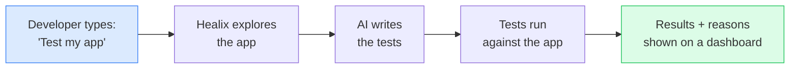
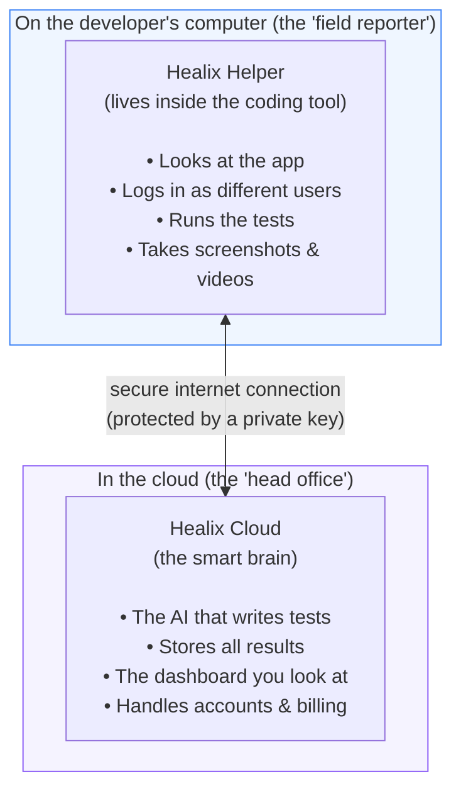
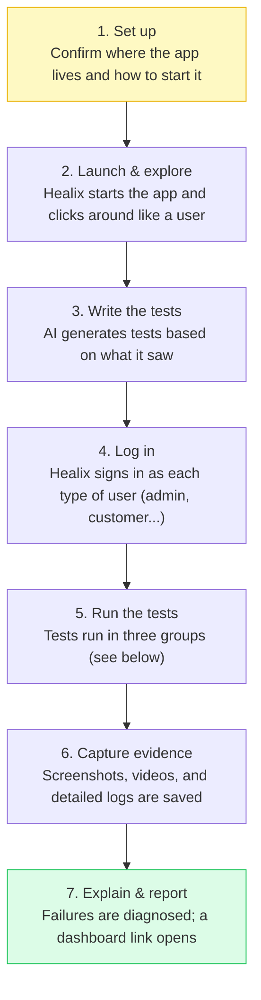
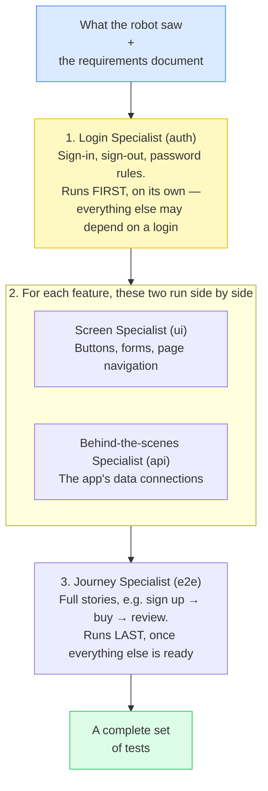
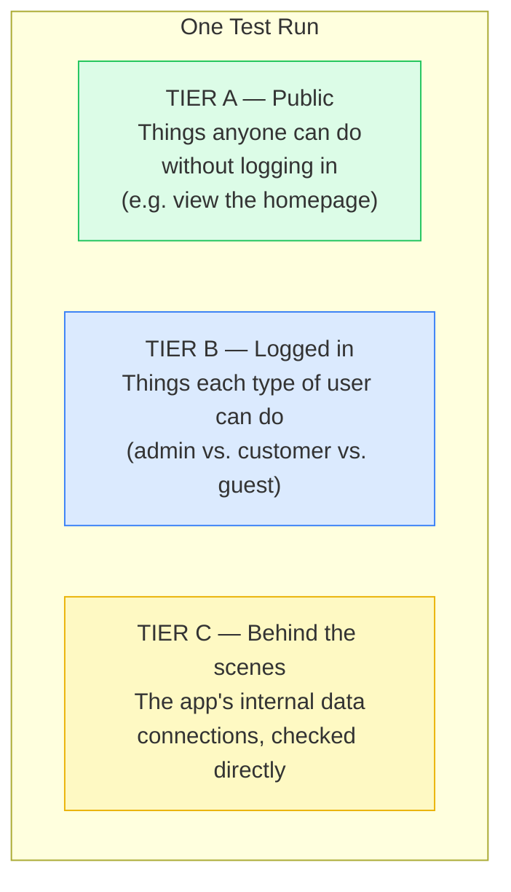
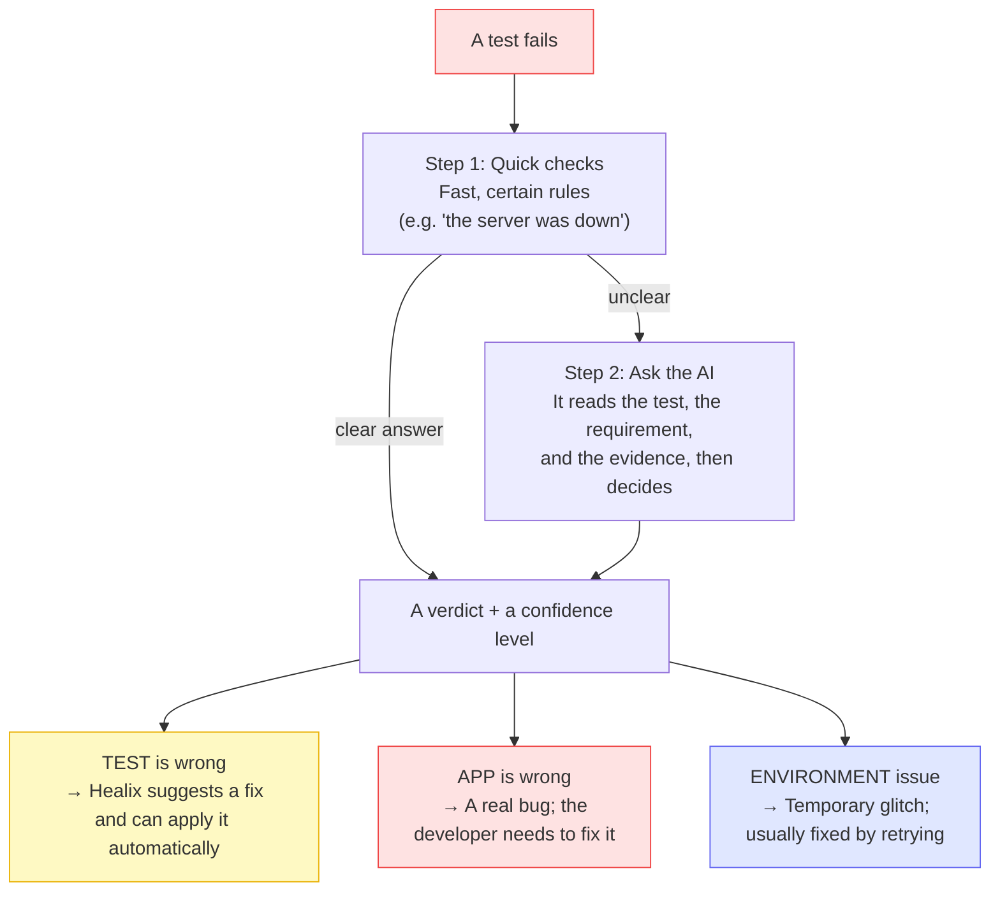
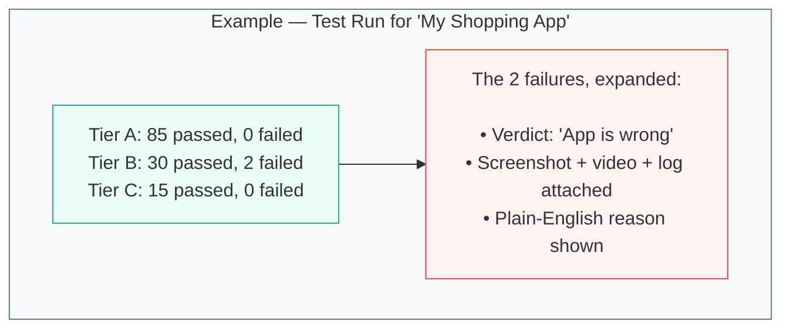
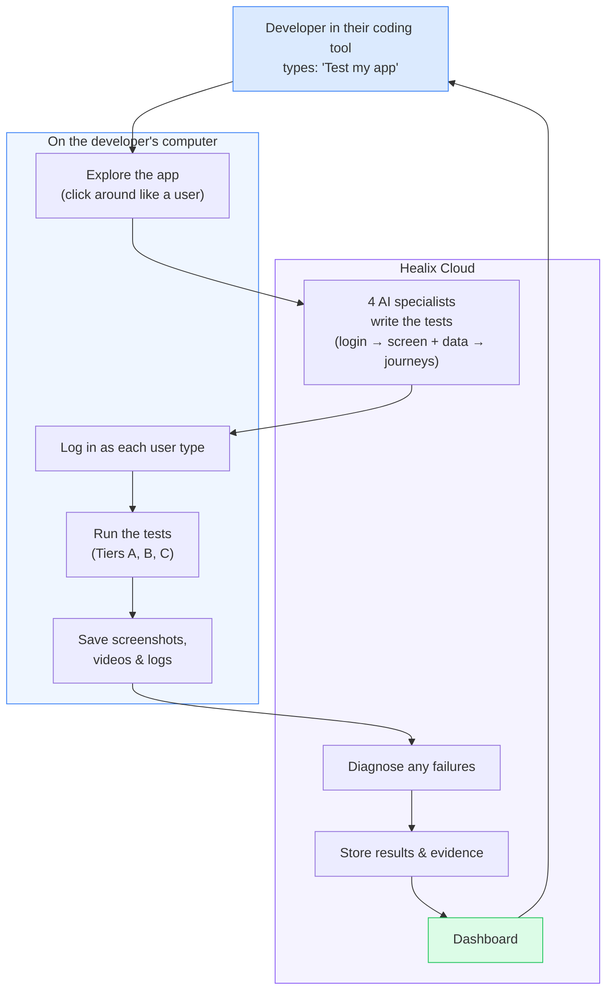

# Healix, Explained

*A plain-English guide to what Healix is, what it does, and how it works.*
*No engineering background required.*

---

## 1. What is Healix?

**Healix is an AI assistant that tests software apps automatically.**

When a developer builds a web application, they need to check that everything
works: that buttons do what they should, forms accept the right information,
logins succeed, and pages load correctly. Doing this by hand is slow and easy
to get wrong. Writing the automated "tests" that do this checking is itself a
big, tedious job.

Healix removes that work. A developer types one instruction inside their coding
tool, and Healix:

1. **Looks at the app** like a real user would — clicking around, filling forms.
2. **Writes the tests** automatically using AI.
3. **Runs the tests** against the app.
4. **Explains any failures** — and even suggests the fix.

The promise in one sentence:

> **Developers get hundreds of working tests without writing any of them by hand —
> and when something breaks, Healix tells them why.**

---

## 2. Who uses it, and why it matters

| Audience | What they get |
|----------|---------------|
| **Developers** | Test coverage in minutes instead of days |
| **Teams shipping software** | Confidence the app works before customers see it |
| **Project / product owners** | Proof that the app meets the written requirements |

The everyday pain Healix solves:

- **Manual testing is slow** — checking every screen by hand takes hours.
- **Writing tests is a project of its own** — and the tests often break.
- **When a test fails, nobody knows why** — is the test wrong, or did the app break? Healix answers that question for you.

---

## 3. The two halves of Healix

Healix has two parts that work together. Think of it like a **field reporter**
and a **head office**.

**Why split it this way?**

- The **Helper** stays small and lives on the developer's machine, where the app
  actually runs. It needs to be close to the app to click around and run tests.
- The **Cloud** holds the expensive, powerful AI and all the saved history. It
  keeps the sensitive AI keys safe — they never touch the developer's computer.

The two communicate over a secure connection, and every message from the Helper
carries a **private key** (like a password) so the Cloud knows it's a real,
paying customer.

**What the Helper can do.** Although most people only ever use *"test my app,"*
the Helper actually offers five distinct commands the coding tool can call:

| Command | What it does |
|---------|--------------|
| **Configure** | Looks at the project and suggests settings before testing |
| **Test my app** | Runs the whole journey end to end (the main one) |
| **Check status** | Reports live progress while a test run is happening |
| **Analyze failures** | Diagnoses failures from an earlier run without re-testing |
| **Generate report** | Builds a results dashboard from existing results |

---

## 4. The journey, step by step

Here is what actually happens after a developer says *"Test my app."*
There are seven stages.

### Stage-by-stage in plain terms

1. **Set up.** Healix opens a short form. It has already guessed most of the
   answers (which app, how to start it). The developer can also hand it a
   **requirements document** (a written description of what the app *should* do)
   and **login details** for different kinds of users.

2. **Launch & explore.** Healix starts the app and a robot "user" browses
   through it — clicking buttons, opening pages, finding forms and login screens.
   It writes down everything it sees.

3. **Write the tests.** All of that information is sent to the Cloud, where AI
   writes the actual tests (more on this in Section 5).

4. **Log in.** If the app has accounts, Healix logs in as each role (for example,
   an *admin* and a *regular customer*) and remembers each session so it can test
   what each type of user is allowed to do.

5. **Run the tests.** Tests run in **three groups** (see Section 6).

6. **Capture evidence.** Whenever a test fails, Healix saves a **screenshot**, a
   **video** of what happened, and a **detailed log**. These are stored safely in
   the cloud, not left on the developer's computer.

7. **Explain & report.** Healix diagnoses each failure (Section 7) and opens a
   **dashboard** showing exactly what passed, what failed, and why.

---

## 5. How the AI writes the tests

Instead of one AI trying to do everything, Healix uses **four specialist AIs**,
each responsible for a different kind of test. They don't all run at once — they
work in a deliberate order so that later specialists can build on earlier ones.

The order matters:

1. **Login Specialist** goes first and alone, because almost everything else
   needs a working sign-in before it can be tested.
2. **Screen Specialist** and **Behind-the-scenes Specialist** then work through
   the app one feature at a time, side by side — one checking what the user sees,
   the other checking the data underneath.
3. **Journey Specialist** goes last, stitching individual features into complete
   real-world stories (for example, *sign up → buy → leave a review*).

**Every test is traceable.** Each generated test is stamped with a tag linking it
back to a specific requirement from the written document. So a project owner can
see *"this requirement is covered by these tests"* — nothing is left to guesswork.

> **For large apps:** the same four specialists can also run as background jobs
> instead of all in one go, so even a huge app won't time out. Healix decides this
> automatically behind the scenes.

---

## 6. The three test groups (Tiers A, B, C)

Apps behave differently depending on whether you're logged in. Healix tests all
situations by splitting tests into three groups and running them together.

| Tier | Plain meaning | Needs a login? |
|------|---------------|----------------|
| **A — Public** | What any visitor can see and do | No |
| **B — Logged in** | What each kind of user is allowed to do | Yes |
| **C — Behind the scenes** | The app's internal plumbing | No |

**A helpful safety feature:** if the login fails (wrong password, login server
down), only **Tier B** is paused. Tiers A and C still run, so you still get useful
results instead of a total failure.

---

## 7. When a test fails: who's to blame?

This is one of Healix's smartest features. A failed test doesn't always mean the
app is broken — sometimes the *test itself* is wrong. Healix figures out which.

The three possible verdicts:

| Verdict | What it means | Who fixes it |
|---------|---------------|--------------|
| **Test is wrong** | The test expected the wrong thing | Healix — it suggests and can auto-apply the fix |
| **App is wrong** | A genuine bug in the app | The developer |
| **Environment issue** | A temporary glitch (server down, timeout) | Usually just retry |

Healix also reports a **confidence level**. If it's very confident the *test* is
wrong, it can fix the test and re-run on its own. If it's unsure, it flags the
failure for a human to look at.

---

## 8. The dashboard — what you see on screen

The dashboard is the web page where everyone (technical or not) can review
results. Here's what each section is for.

| Page | What you do there |
|------|-------------------|
| **Home** | A quick overview: recent runs, how many tests passed, account usage |
| **All Tests** | The full history of every test run, with pass/fail counts |
| **Test Run Detail** | A deep look at one run: the three tiers, each test, and the evidence (screenshots, videos, logs) for failures |
| **Workspace** | Groups runs by project, with a "Coverage Map" and tools to compare one run against another over time |
| **Create Tests** | Start a test run from the website (instead of the coding tool) |
| **Import Tests** | Bring existing tests into Healix |
| **MCP Server** | Setup and install instructions for the Helper inside the coding tool |
| **API Keys** | Manage the private key that connects the Helper to the Cloud |
| **Monitoring** | A live health view: success rates, common errors, trends |
| **Plan & Billing** | The current plan, usage, and upgrades |
| **Profile** | Personal account details |

The **Test Run Detail** page is where the action is. A simplified view (the
numbers below are just an example to show the layout):

---

## 9. A mini glossary

| Term | Plain meaning |
|------|---------------|
| **Test** | An automatic check that one thing in the app works |
| **Test run** | One full session of Healix testing the app (produces many tests) |
| **Tier A / B / C** | The three groups: public, logged-in, and behind-the-scenes tests |
| **Artifact** | Evidence saved from a test: a screenshot, video, or detailed log |
| **Requirements document (PRD)** | A written description of what the app should do |
| **Acceptance criteria** | Specific, checkable statements pulled from that document (e.g. "users can reset their password") |
| **Verdict** | Healix's diagnosis of a failure: test wrong / app wrong / environment glitch |
| **Confidence level** | How sure Healix is about a verdict — high confidence means it can act on its own |
| **The Helper (MCP)** | The small Healix program inside the developer's coding tool |
| **The Cloud (webapp)** | The online brain: the AI, the dashboard, and the stored history |
| **API key** | A private password the Helper uses to prove who it is to the Cloud |

---

## 10. The whole picture, on one page

**In short:** Healix watches an app, writes tests for it with AI, runs those
tests as different kinds of users, and then clearly explains what works, what
doesn't, and why — all from a single instruction inside the developer's coding
tool.

---

*This document describes Healix in non-technical terms. Diagrams use Mermaid and
render automatically in most Markdown viewers (GitHub, VS Code, etc.).*
